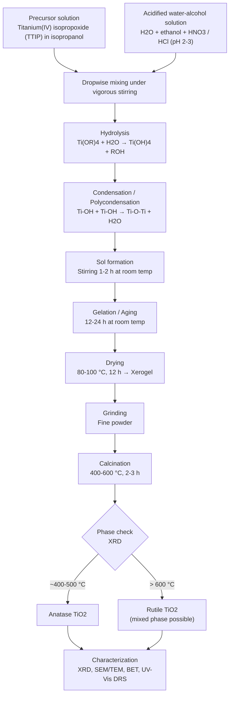

# Mermaid-assignment
Assignment for Scientific Journal Writing

```mermaid
flowchart TD
    A["Precursor solution<br/>Titanium(IV) isopropoxide (TTIP) in isopropanol"] --> C
    B["Acidified water-alcohol solution<br/>H2O + ethanol + HNO3 / HCl (pH 2-3)"] --> C
    C["Dropwise mixing under vigorous stirring"] --> D["Hydrolysis<br/>Ti(OR)4 + H2O → Ti(OH)4 + ROH"]
    D --> E["Condensation / Polycondensation<br/>Ti-OH + Ti-OH → Ti-O-Ti + H2O"]
    E --> F["Sol formation<br/>Stirring 1-2 h at room temp"]
    F --> G["Gelation / Aging<br/>12-24 h at room temp"]
    G --> H["Drying<br/>80-100 °C, 12 h → Xerogel"]
    H --> I["Grinding<br/>Fine powder"]
    I --> J["Calcination<br/>400-600 °C, 2-3 h"]
    J --> K{"Phase check<br/>XRD"}
    K -->|"~400-500 °C"| L["Anatase TiO2"]
    K -->|"> 600 °C"| M["Rutile TiO2<br/>(mixed phase possible)"]
    L --> N["Characterization<br/>XRD, SEM/TEM, BET, UV-Vis DRS"]
    M --> N
```
